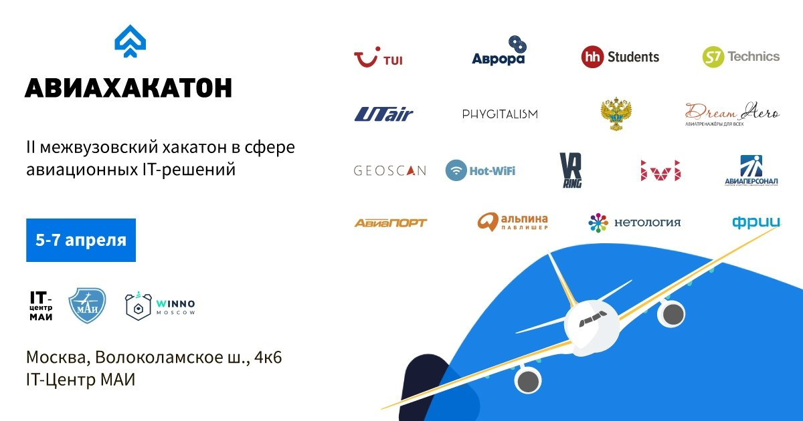

# Авиахакатон 2019

Это уже второй наш **АВИАХАКАТОН**, который объединит на одной площадке представителей авиакомпаний, IT-компаний, аэропортов и разработчиков авиационной техники для создания инновационных IT-решений в авиации. Это самый масштабный хакатон в России в авиаиндустрии с международным участием!

Целью мероприятия является привлечение студентов, аспирантов и разработчиков к решению ключевых проблем авиакомпаний и аэропортов в сфере IT. По итогам работы команды презентуют своё решение представителям компаний партнёров.

### Призы
:rage2: :moneybag: :dollar:  Призы на сумму 200'000 рублей :dollar: :moneybag: :rage4:
### Партнеры
- Аврора
- TUI 
- Utair 
- Phygitalism 
- Геоскан 
- Авиаперсонал 
- S7

### Направления
- VR and AR
- Сервисы для туристов
- Сервисы для пассажиров
- Сервисы в аэропорту
- Обслуживание самолётов
- Сервисы для операторов беспилотников
